# MeetMyShow
Online Movie Ticket Booking App 
Built clone of BookMyShow ticket booking app using Kotlin
# Screenshot

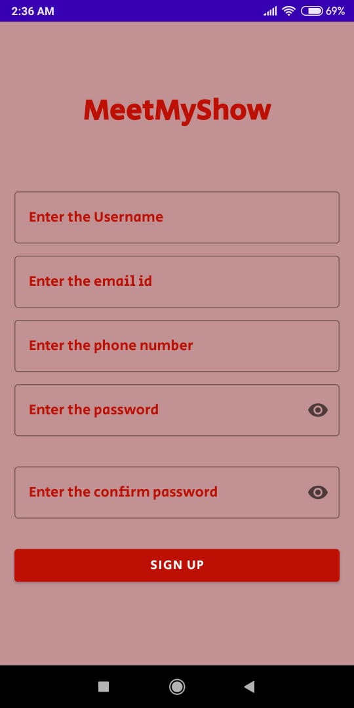
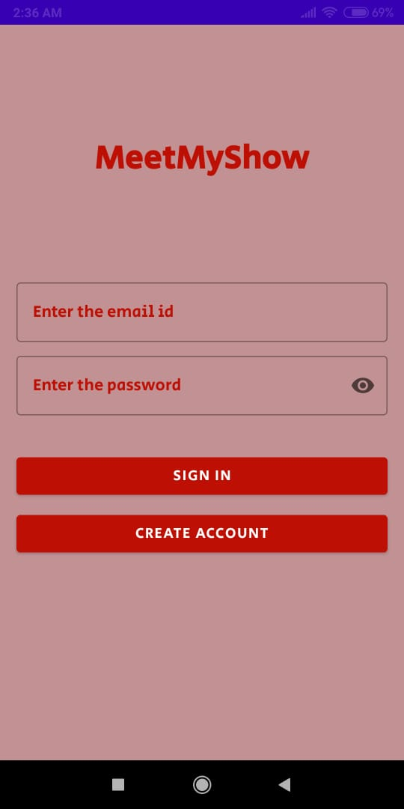
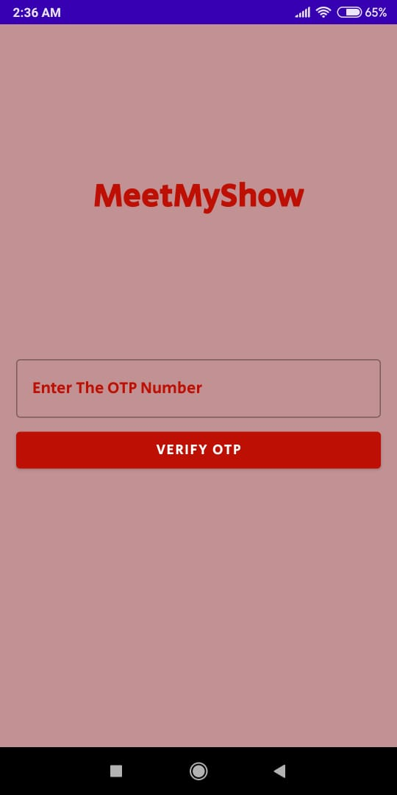
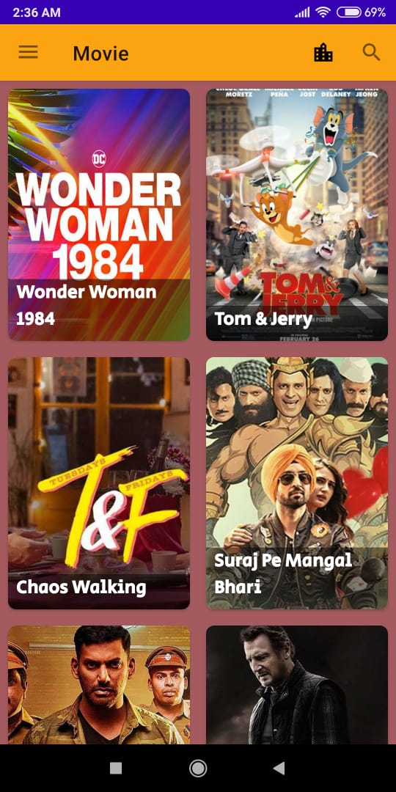

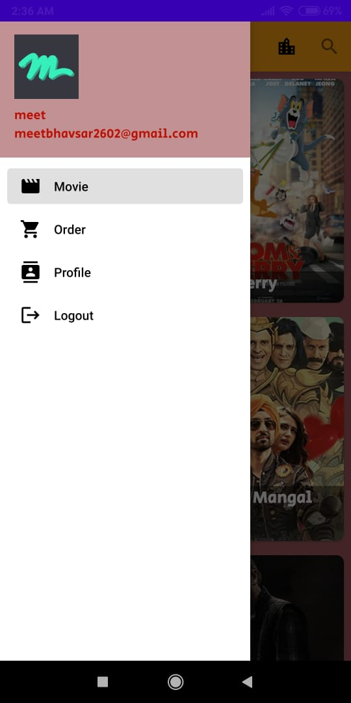
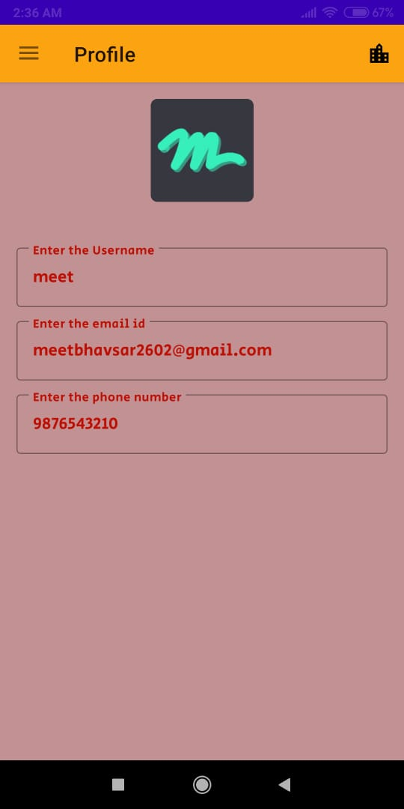
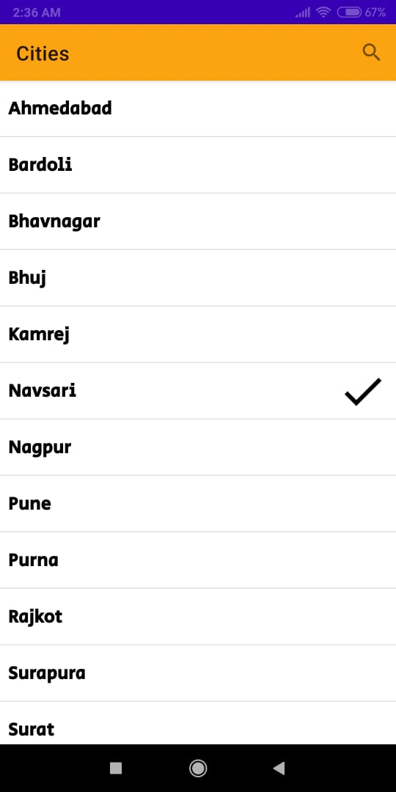
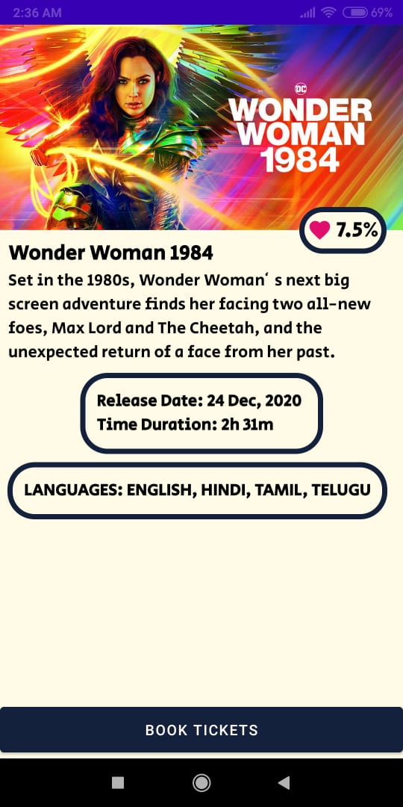

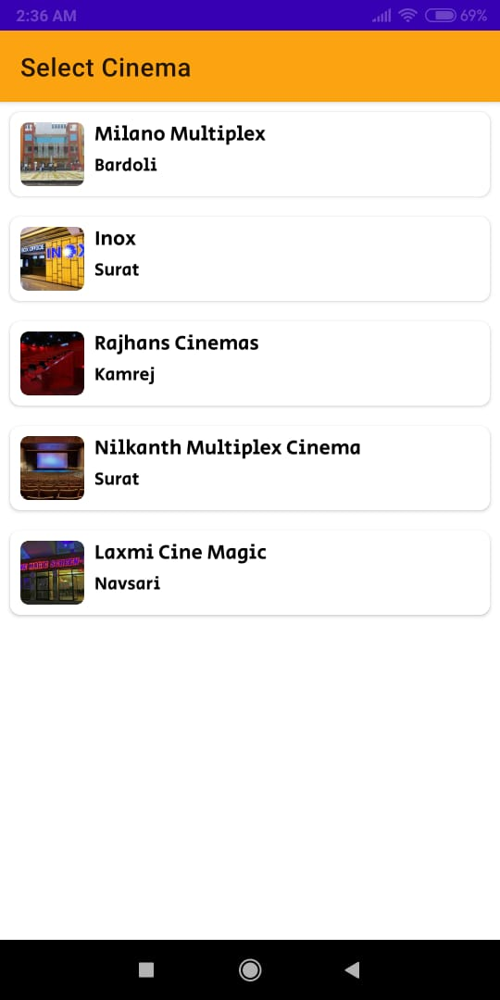
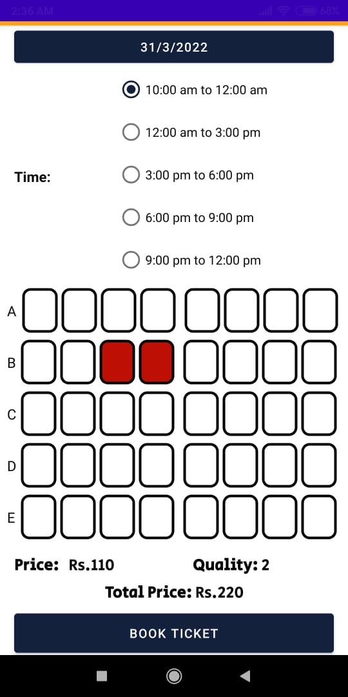
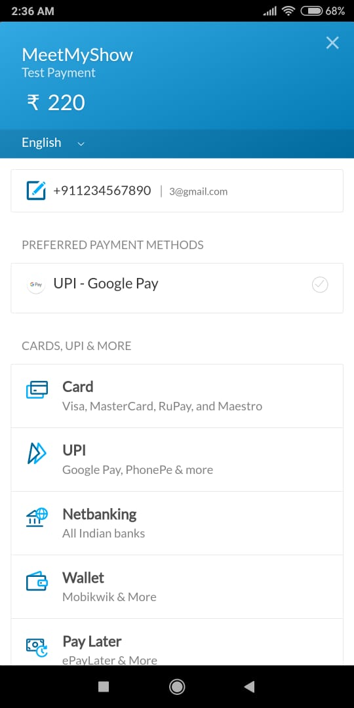
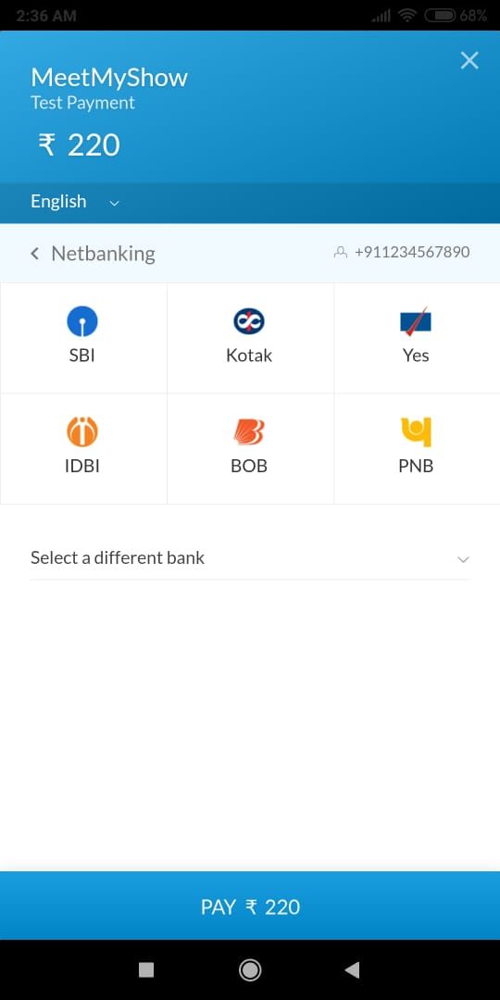

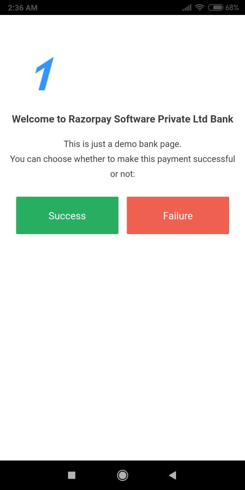
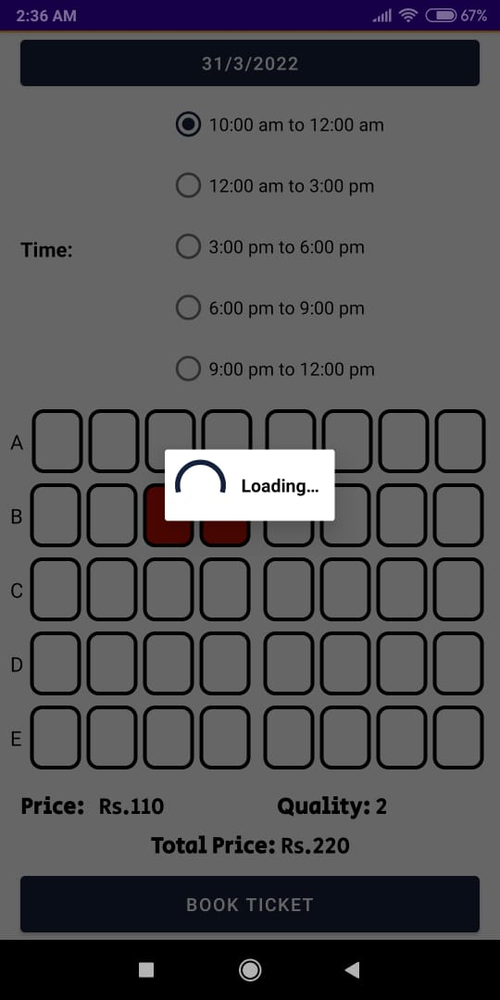
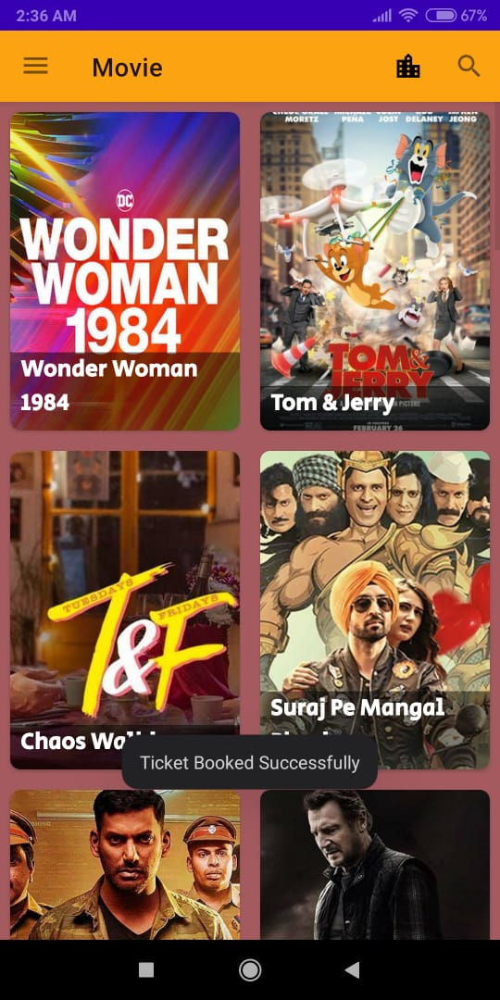
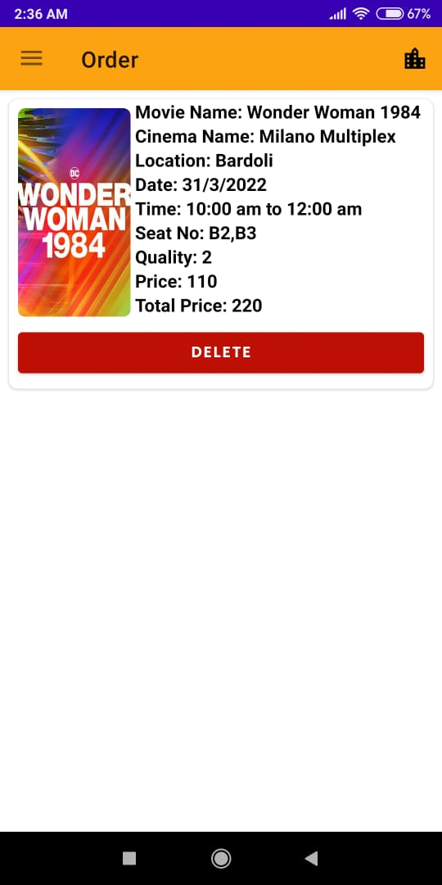

# [Project Report](https://github.com/meet2602/MeetMyShow/blob/master/screenshot/Project%20Report.pdf)
# [All Diagram](https://github.com/meet2602/MeetMyShow/tree/master/screenshot/diagram)
# [Sample Data](https://github.com/meet2602/MeetMyShow/tree/master/screenshot/movie_sample_data.json)

# [YouTube Video Link](https://youtu.be/qzM71WWkyK4)

